# BMAD Phase 3: Prototype - Create and Test New Concepts
**Project:** Tripo04OS Multi-Service Platform
**Based on:** Phase 1 Diagnosis & Phase 2 Ideation
**Analysis Date:** 2026-01-06

---

## Executive Summary

This document presents detailed prototypes for the top 5 highest-priority innovations identified in Phase 2. Each prototype includes feature designs, service boundary models, pricing scenarios, and user journey flows to enable rapid testing and validation.

---

## Prototype 1: Universal Loyalty Program

### 1.1 Feature Design

#### 1.1.1 Core Features

**Tier System:**
```yaml
loyalty_tiers:
  BRONZE:
    entry_points: 0
    benefits:
      - "1 point per $1 spent"
      - "Birthday bonus (500 points)"
      - "Standard support"
    
  SILVER:
    entry_points: 5,000
    benefits:
      - "1.25 points per $1 spent"
      - "5% discount on rides"
      - "Priority support"
      - "Birthday bonus (1,000 points)"
      - "Free delivery credits ($10/month)"
    
  GOLD:
    entry_points: 25,000
    benefits:
      - "1.5 points per $1 spent"
      - "10% discount on rides"
      - "Priority matching"
      - "Premium support"
      - "Birthday bonus (2,500 points)"
      - "Free delivery credits ($25/month)"
      - "Exclusive promotions"
    
  PLATINUM:
    entry_points: 100,000
    benefits:
      - "2 points per $1 spent"
      - "15% discount on rides"
      - "Highest priority matching"
      - "Dedicated support"
      - "Birthday bonus (5,000 points)"
      - "Free delivery credits ($50/month)"
      - "Exclusive promotions"
      - "Early access to new features"
      - "VIP events"
```

**Point Earning Rules:**
```yaml
point_earning:
  rides:
    base: "1 point per $1"
    bonus_multiplier: "Tier multiplier (1x, 1.25x, 1.5x, 2x)"
    surge_bonus: "+50% points during surge"
    shared_bonus: "+25% points for shared rides"
    
  food_delivery:
    base: "1 point per $1"
    bonus_multiplier: "Tier multiplier"
    restaurant_bonus: "+10% points for partner restaurants"
    
  other_services:
    base: "1 point per $1"
    bonus_multiplier: "Tier multiplier"
    
  partner_activities:
    hotel_booking: "10 points per $1"
    airline_booking: "5 points per $1"
    retail_purchase: "2 points per $1"
```

**Point Redemption Options:**
```yaml
point_redemption:
  ride_discounts:
    - "100 points = $1 off"
    - "Minimum 500 points per redemption"
    
  free_rides:
    - "5,000 points = free ride (up to $20)"
    - "10,000 points = free ride (up to $40)"
    - "25,000 points = free ride (up to $100)"
    
  delivery_credits:
    - "500 points = $5 delivery credit"
    - "1,000 points = $10 delivery credit"
    
  partner_rewards:
    - "Hotel discounts (varies by partner)"
    - "Airline miles (varies by partner)"
    - "Retail gift cards (varies by partner)"
    
  upgrades:
    - "5,000 points = upgrade to premium driver"
    - "10,000 points = skip queue"
```

#### 1.1.2 Database Schema

```sql
-- Loyalty Program Tables
loyalty_program (
  id UUID PK,
  user_id UUID UNIQUE,
  current_tier ENUM,           -- BRONZE, SILVER, GOLD, PLATINUM
  points_balance INT DEFAULT 0,
  lifetime_points INT DEFAULT 0,
  tier_entry_date TIMESTAMP,
  points_earned_this_month INT DEFAULT 0,
  points_redeemed_this_month INT DEFAULT 0,
  created_at TIMESTAMP,
  updated_at TIMESTAMP
);

loyalty_transactions (
  id UUID PK,
  user_id UUID,
  transaction_type ENUM,       -- EARN, REDEEM, BONUS, EXPIRE
  points_amount INT,
  order_id UUID NULL,          -- Reference to earning order
  redemption_id UUID NULL,     -- Reference to redemption
  source ENUM,                 -- RIDE, FOOD, PARTNER, BONUS
  description TEXT,
  created_at TIMESTAMP
);

loyalty_tier_history (
  id UUID PK,
  user_id UUID,
  previous_tier ENUM,
  new_tier ENUM,
  points_at_upgrade INT,
  upgrade_date TIMESTAMP
);

loyalty_redemptions (
  id UUID PK,
  user_id UUID,
  redemption_type ENUM,        -- RIDE_DISCOUNT, FREE_RIDE, DELIVERY_CREDIT, PARTNER
  points_used INT,
  monetary_value DECIMAL,
  order_id UUID NULL,
  status ENUM,                 -- PENDING, APPLIED, EXPIRED
  created_at TIMESTAMP
);

loyalty_partner_programs (
  id UUID PK,
  partner_id UUID,
  partner_name TEXT,
  point_multiplier FLOAT,
  redemption_options JSONB,
  active BOOLEAN DEFAULT true,
  created_at TIMESTAMP
);
```

#### 1.1.3 API Endpoints

```yaml
loyalty_apis:
  GET /api/v1/loyalty/status:
    description: "Get user's loyalty status"
    response:
      tier: "BRONZE"
      points_balance: 2500
      lifetime_points: 7500
      points_to_next_tier: 2500
      benefits: [...]
      
  GET /api/v1/loyalty/transactions:
    description: "Get loyalty transaction history"
    parameters:
      - limit: 50
      - offset: 0
      - type: "EARN,REDEEM,BONUS"
    response:
      transactions: [...]
      
  POST /api/v1/loyalty/redeem:
    description: "Redeem points"
    body:
      redemption_type: "RIDE_DISCOUNT"
      points: 1000
    response:
      redemption_id: "uuid"
      points_used: 1000
      monetary_value: 10.00
      
  GET /api/v1/loyalty/partners:
    description: "Get partner programs"
    response:
      partners: [...]
      
  POST /api/v1/loyalty/partners/earn:
    description: "Earn points from partner"
    body:
      partner_id: "uuid"
      transaction_amount: 100.00
      transaction_reference: "ref123"
    response:
      points_earned: 200
      new_balance: 2700
```

### 1.2 Service Boundary Model

```yaml
loyalty_service_boundaries:
  owns:
    - "Loyalty program configuration"
    - "User tier management"
    - "Point balance tracking"
    - "Transaction recording"
    - "Redemption processing"
    - "Partner program management"
    
  consumes:
    - "Order Service: For order-based point earning"
    - "Payment Service: For monetary redemption processing"
    - "Identity Service: For user profile data"
    - "Notification Service: For tier change notifications"
    
  provides:
    - "Point earning API"
    - "Point redemption API"
    - "Tier status API"
    - "Transaction history API"
    - "Partner program API"
    
  events_published:
    - "LOYALTY_POINTS_EARNED"
    - "LOYALTY_POINTS_REDEEMED"
    - "LOYALTY_TIER_CHANGED"
    - "LOYALTY_BONUS_GRANTED"
    
  events_subscribed:
    - "ORDER_COMPLETED"
    - "PAYMENT_PROCESSED"
```

### 1.3 Pricing Scenario

**Revenue Impact Analysis:**

```yaml
loyalty_program_economics:
  costs:
    - "Tier discounts: 5-15% of ride revenue"
    - "Free delivery credits: $10-50/month per user"
    - "Point redemption value: 1 point = $0.01"
    - "Program administration: $0.50/user/month"
    
  benefits:
    - "Increased retention: 15-20% improvement"
    - "Increased frequency: 20-30% more orders"
    - "Higher customer lifetime value: 25-40% increase"
    - "Cross-vertical adoption: 30% more multi-vertical users"
    
  roi_calculation:
    assumptions:
      - "Current customer base: 1M users"
      - "Average monthly spend: $100/user"
      - "Current retention rate: 70%"
      - "Current order frequency: 3/month"
      
    without_loyalty:
      - "Monthly revenue: $100M"
      - "Annual revenue: $1.2B"
      
    with_loyalty:
      - "Retention improvement: 15% → 80.5%"
      - "Frequency improvement: 20% → 3.6/month"
      - "Monthly revenue: $120M"
      - "Annual revenue: $1.44B"
      - "Revenue increase: $240M/year"
      
    costs:
      - "Discount costs: $60M/year"
      - "Delivery credits: $30M/year"
      - "Administration: $6M/year"
      - "Total costs: $96M/year"
      
    net_roi:
      - "Net benefit: $144M/year"
      - "ROI: 150%"
      - "Payback period: 6 months"
```

### 1.4 User Journey Flow

**Journey 1: New User Joins Loyalty Program**

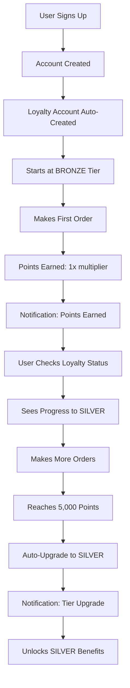

**Journey 2: User Redeems Points**

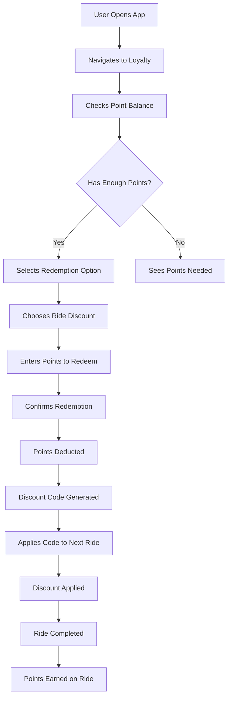

**Journey 3: User Reaches New Tier**

```mermaid
graph TD
    A[User at SILVER: 20,000 Points] --> B[Makes $50 Order]
    B --> C[Earns 75 Points (1.5x multiplier)]
    C --> D[Balance: 20,075 Points]
    D --> E{Reaches 25,000?}
    E -->|Not Yet| F[Continues Earning]
    E -->|Yes| G[Triggers Tier Upgrade]
    G --> H[Background Process Checks]
    H --> I[Validates Tier Requirements]
    I --> J[Updates User to GOLD]
    J --> K[Records Tier History]
    K --> L[Sends Push Notification]
    L --> M[User Opens App]
    M --> N[Sees GOLD Badge]
    N --> O[Views New Benefits]
    O --> P[Excited to Use Benefits]
```

---

## Prototype 2: Dynamic Subscription Tiers

### 2.1 Feature Design

#### 2.1.1 Subscription Plans

```yaml
subscription_plans:
  BASIC:
    monthly_price: 9.99
    annual_price: 99.99  # 17% discount
    benefits:
      rides:
        discount_percent: 5
        max_monthly_discount: 50.00
      food:
        delivery_credits: 10.00
      matching:
        priority_multiplier: 1.0
      support:
        level: "Standard"
        response_time: "24 hours"
      analytics:
        basic_stats: true
        advanced_analytics: false
        
  PREMIUM:
    monthly_price: 19.99
    annual_price: 199.99  # 17% discount
    benefits:
      rides:
        discount_percent: 10
        max_monthly_discount: 100.00
      food:
        delivery_credits: 20.00
      matching:
        priority_multiplier: 1.5
      support:
        level: "Priority"
        response_time: "4 hours"
      analytics:
        basic_stats: true
        advanced_analytics: true
        
  UNLIMITED:
    monthly_price: 99.99
    annual_price: 999.99  # 17% discount
    benefits:
      rides:
        discount_percent: 100
        max_monthly_rides: 20
        max_monthly_value: 500.00
      food:
        delivery_credits: 50.00
      matching:
        priority_multiplier: 2.0
      support:
        level: "Premium"
        response_time: "1 hour"
      analytics:
        basic_stats: true
        advanced_analytics: true
        custom_reports: true
      exclusive:
        - "Early access to new features"
        - "Exclusive promotions"
        - "VIP events"
```

#### 2.1.2 Database Schema

```sql
-- Subscription Tables
subscription_plans (
  id UUID PK,
  plan_code ENUM,             -- BASIC, PREMIUM, UNLIMITED
  name TEXT,
  monthly_price DECIMAL,
  annual_price DECIMAL,
  benefits JSONB,
  is_active BOOLEAN DEFAULT true,
  created_at TIMESTAMP,
  updated_at TIMESTAMP
);

user_subscriptions (
  id UUID PK,
  user_id UUID UNIQUE,
  plan_id UUID,
  billing_cycle ENUM,         -- MONTHLY, ANNUAL
  start_date TIMESTAMP,
  next_billing_date TIMESTAMP,
  auto_renew BOOLEAN DEFAULT true,
  status ENUM,                -- ACTIVE, PAUSED, CANCELLED, EXPIRED
  benefits_used JSONB,
  created_at TIMESTAMP,
  updated_at TIMESTAMP
);

subscription_usage (
  id UUID PK,
  user_id UUID,
  subscription_id UUID,
  usage_type ENUM,            -- RIDE_DISCOUNT, FOOD_CREDIT, UNLIMITED_RIDE
  amount DECIMAL,
  reference_id UUID,          -- Order ID
  usage_date TIMESTAMP
);

subscription_transactions (
  id UUID PK,
  user_id UUID,
  subscription_id UUID,
  transaction_type ENUM,      -- CHARGE, REFUND, UPGRADE, DOWNGRADE
  amount DECIMAL,
  currency TEXT,
  payment_method_id UUID,
  status ENUM,                -- PENDING, COMPLETED, FAILED, REFUNDED
  transaction_date TIMESTAMP
);

subscription_benefits (
  id UUID PK,
  subscription_id UUID,
  benefit_type ENUM,
  benefit_value JSONB,
  used_amount DECIMAL DEFAULT 0,
  max_amount DECIMAL,
  reset_date TIMESTAMP
);
```

#### 2.1.3 API Endpoints

```yaml
subscription_apis:
  GET /api/v1/subscriptions/plans:
    description: "Get available subscription plans"
    response:
      plans: [...]
      
  POST /api/v1/subscriptions/subscribe:
    description: "Subscribe to a plan"
    body:
      plan_id: "uuid"
      billing_cycle: "MONTHLY"
      payment_method_id: "uuid"
    response:
      subscription_id: "uuid"
      start_date: "2026-01-06"
      next_billing_date: "2026-02-06"
      
  GET /api/v1/subscriptions/my:
    description: "Get user's current subscription"
    response:
      plan: "PREMIUM"
      status: "ACTIVE"
      benefits_remaining: {...}
      next_billing_date: "2026-02-06"
      
  POST /api/v1/subscriptions/cancel:
    description: "Cancel subscription"
    body:
      reason: "text"
      feedback: "text"
    response:
      cancellation_date: "2026-02-06"
      benefits_valid_until: "2026-02-06"
      
  POST /api/v1/subscriptions/upgrade:
    description: "Upgrade to higher tier"
    body:
      target_plan_id: "uuid"
    response:
      new_subscription_id: "uuid"
      prorated_charge: 15.00
      effective_date: "2026-01-06"
      
  GET /api/v1/subscriptions/usage:
    description: "Get subscription usage"
    parameters:
      - month: "2026-01"
    response:
      rides_discounted: 15
      rides_discount_amount: 45.00
      food_credits_used: 15.00
      unlimited_rides_used: 8
```

### 2.2 Service Boundary Model

```yaml
subscription_service_boundaries:
  owns:
    - "Subscription plan configuration"
    - "User subscription management"
    - "Billing and payment processing"
    - "Benefit tracking and usage"
    - "Subscription lifecycle management"
    
  consumes:
    - "Order Service: For applying discounts"
    - "Payment Service: For billing"
    - "Identity Service: For user data"
    - "Notification Service: For billing reminders"
    
  provides:
    - "Plan management API"
    - "Subscription API"
    - "Benefit application API"
    - "Usage tracking API"
    - "Billing API"
    
  events_published:
    - "SUBSCRIPTION_CREATED"
    - "SUBSCRIPTION_CANCELLED"
    - "SUBSCRIPTION_UPGRADED"
    - "SUBSCRIPTION_RENEWED"
    - "SUBSCRIPTION_BENEFIT_USED"
    
  events_subscribed:
    - "PAYMENT_SUCCESSFUL"
    - "PAYMENT_FAILED"
    - "ORDER_COMPLETED"
```

### 2.3 Pricing Scenario

**Revenue Impact Analysis:**

```yaml
subscription_economics:
  assumptions:
    - "Current customer base: 1M users"
    - "Average monthly spend: $100/user"
    - "Subscription adoption rate: 15% in year 1"
    - "Churn rate: 5% monthly"
    
  adoption_projection:
    year_1:
      - "Month 1: 10,000 subscribers (1%)"
      - "Month 6: 100,000 subscribers (10%)"
      - "Month 12: 150,000 subscribers (15%)"
      
    year_2:
      - "Month 24: 250,000 subscribers (25%)"
      
  revenue_breakdown:
    year_1:
      subscribers: 150,000
      plan_distribution:
        BASIC: 60% (90,000 users × $9.99 = $899K/month)
        PREMIUM: 30% (45,000 users × $19.99 = $900K/month)
        UNLIMITED: 10% (15,000 users × $99.99 = $1.5M/month)
      monthly_recurring_revenue: $3.3M
      annual_recurring_revenue: $39.6M
      
    year_2:
      subscribers: 250,000
      plan_distribution:
        BASIC: 50% (125,000 users × $9.99 = $1.25M/month)
        PREMIUM: 35% (87,500 users × $19.99 = $1.75M/month)
        UNLIMITED: 15% (37,500 users × $99.99 = $3.75M/month)
      monthly_recurring_revenue: $6.75M
      annual_recurring_revenue: $81M
      
  costs:
    - "Discount costs: 30% of subscription revenue"
    - "Delivery credits: 20% of subscription revenue"
    - "Payment processing: 3% of subscription revenue"
    - "Support costs: 5% of subscription revenue"
    - "Total costs: 58% of subscription revenue"
    
  net_revenue:
    year_1:
      - "Gross: $39.6M"
      - "Costs: $23M"
      - "Net: $16.6M"
      
    year_2:
      - "Gross: $81M"
      - "Costs: $47M"
      - "Net: $34M"
      
  retention_impact:
    - "Subscriber retention: 85% vs 70% non-subscribers"
    - "Subscriber frequency: 4.5/month vs 3/month non-subscribers"
    - "Subscriber LTV: $1,200 vs $600 non-subscribers"
```

### 2.4 User Journey Flow

**Journey 1: User Subscribes**

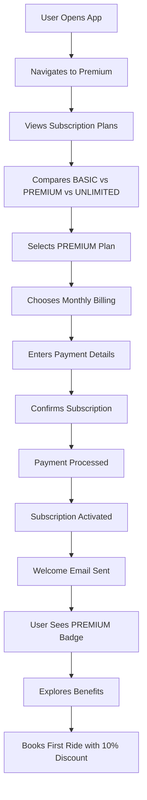

**Journey 2: User Uses Benefits**

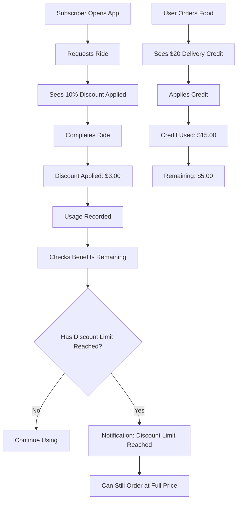

**Journey 3: Subscription Renewal**

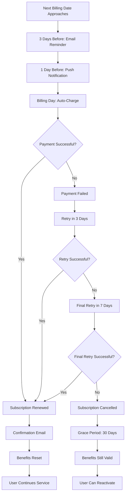

---

## Prototype 3: Healthcare Vertical

### 3.1 Feature Design

#### 3.1.1 Healthcare-Specific Features

```yaml
healthcare_features:
  vehicle_types:
    standard:
      description: "Standard vehicle for ambulatory patients"
      capacity: 4 passengers
      wheelchair_accessible: false
      
    wheelchair_accessible:
      description: "Wheelchair accessible vehicle"
      capacity: 1 wheelchair + 3 passengers
      wheelchair_accessible: true
      lift_or_ramp: true
      
    stretcher:
      description: "Stretcher transport for non-emergency"
      capacity: 1 stretcher + 2 attendants
      medical_equipment: true
      trained_attendant: true
      
  service_types:
    routine_appointments:
      description: "Scheduled medical appointments"
      booking_window: "Up to 30 days in advance"
      pickup_window: "15 minutes"
      wait_time: "Up to 30 minutes at destination"
      
    dialysis_transport:
      description: "Regular dialysis appointments"
      booking_window: "Recurring schedule"
      pickup_window: "10 minutes"
      wait_time: "Up to 2 hours at destination"
      priority: "High"
      
    hospital_discharge:
      description: "Transport from hospital to home"
      booking_window: "Same day"
      pickup_window: "30 minutes"
      coordination: "Hospital staff"
      
    pharmacy_pickup:
      description: "Pick up medications"
      booking_window: "Same day"
      pickup_window: "15 minutes"
      wait_time: "Up to 15 minutes"
      
  safety_features:
    driver_training:
      - "Healthcare-specific training"
      - "First aid certification"
      - "HIPAA compliance training"
      - "Patient assistance training"
      
    patient_support:
      - "Door-to-door assistance"
      - "Help with mobility devices"
      - "Medication handling"
      - "Emergency protocol"
      
    communication:
      - "Caregiver notifications"
      - "Real-time tracking for family"
      - "Two-way communication"
      - "Emergency contacts"
      
  integration_features:
    emr_integration:
      - "Epic, Cerner, Allscripts"
      - "Appointment sync"
      - "Patient information"
      - "Insurance verification"
      
    insurance_billing:
      - "Auto-bill insurance"
      - "Pre-authorization"
      - "Claims submission"
      - "Explanation of benefits"
      
    healthcare_partners:
      - "Hospitals"
      - "Clinics"
      - "Dialysis centers"
      - "Pharmacies"
      - "Insurance companies"
```

#### 3.1.2 Database Schema

```sql
-- Healthcare Vertical Tables
healthcare_service_types (
  id UUID PK,
  service_code ENUM,          -- ROUTINE, DIALYSIS, DISCHARGE, PHARMACY
  name TEXT,
  description TEXT,
  pickup_window_minutes INT,
  wait_time_minutes INT,
  priority ENUM,              -- LOW, MEDIUM, HIGH
  requires_pre_auth BOOLEAN DEFAULT false,
  created_at TIMESTAMP
);

healthcare_vehicle_types (
  id UUID PK,
  vehicle_code ENUM,          -- STANDARD, WHEELCHAIR, STRETCHER
  name TEXT,
  description TEXT,
  passenger_capacity INT,
  wheelchair_accessible BOOLEAN,
  lift_or_ramp BOOLEAN,
  medical_equipment BOOLEAN,
  trained_attendant BOOLEAN,
  created_at TIMESTAMP
);

healthcare_order_details (
  id UUID PK,
  order_id UUID UNIQUE,
  service_type_id UUID,
  vehicle_type_id UUID,
  
  -- Patient Information
  patient_name TEXT,
  patient_dob DATE,
  medical_needs JSONB,        -- wheelchair, oxygen, etc.
  mobility_assistance ENUM,  -- NONE, MINOR, MAJOR
  assistance_level ENUM,      -- DOOR_TO_DOOR, CURBSIDE, NONE
  
  -- Appointment Information
  appointment_time TIMESTAMP,
  appointment_location GEO,
  appointment_type TEXT,
  healthcare_provider_id UUID,
  provider_name TEXT,
  
  -- Caregiver Information
  caregiver_id UUID NULL,
  caregiver_name TEXT,
  caregiver_phone TEXT,
  notify_caregiver BOOLEAN DEFAULT true,
  
  -- Insurance Information
  insurance_provider_id UUID,
  insurance_policy_number TEXT,
  pre_authorization_code TEXT NULL,
  insurance_verified BOOLEAN DEFAULT false,
  
  -- Special Instructions
  special_instructions TEXT,
  emergency_contact_name TEXT,
  emergency_contact_phone TEXT,
  
  -- Status
  status ENUM,               -- PENDING, CONFIRMED, IN_PROGRESS, COMPLETED, CANCELLED
  pickup_confirmed BOOLEAN DEFAULT false,
  driver_arrived BOOLEAN DEFAULT false,
  patient_picked_up BOOLEAN DEFAULT false,
  patient_dropped_off BOOLEAN DEFAULT false,
  
  created_at TIMESTAMP,
  updated_at TIMESTAMP
);

healthcare_providers (
  id UUID PK,
  provider_type ENUM,        -- HOSPITAL, CLINIC, DIALYSIS_CENTER, PHARMACY
  name TEXT,
  location GEO,
  contact_phone TEXT,
  contact_email TEXT,
  emr_system ENUM NULL,       -- EPIC, CERNER, ALLSCRIPTS, NONE
  api_integration BOOLEAN DEFAULT false,
  insurance_partners JSONB,
  active BOOLEAN DEFAULT true,
  created_at TIMESTAMP
);

healthcare_driver_certifications (
  id UUID PK,
  driver_id UUID,
  certification_type ENUM,   -- FIRST_AID, HIPAA, PATIENT_ASSIST, WHEELCHAIR
  certification_number TEXT,
  issued_date DATE,
  expiry_date DATE,
  verified BOOLEAN DEFAULT false,
  created_at TIMESTAMP
);

healthcare_insurance_providers (
  id UUID PK,
  name TEXT,
  insurance_type ENUM,       -- MEDICARE, MEDICAID, PRIVATE, VA
  coverage_types JSONB,       -- Non-emergency medical transport
  pre_auth_required BOOLEAN DEFAULT false,
  api_integration BOOLEAN DEFAULT false,
  reimbursement_rate DECIMAL,
  active BOOLEAN DEFAULT true,
  created_at TIMESTAMP
);
```

#### 3.1.3 API Endpoints

```yaml
healthcare_apis:
  GET /api/v1/healthcare/service-types:
    description: "Get available healthcare service types"
    response:
      service_types: [...]
      
  POST /api/v1/healthcare/book:
    description: "Book healthcare transport"
    body:
      service_type_id: "uuid"
      vehicle_type_id: "uuid"
      pickup_location: {...}
      dropoff_location: {...}
      appointment_time: "2026-01-10T14:00:00Z"
      patient_name: "John Doe"
      patient_dob: "1950-01-01"
      medical_needs: {...}
      caregiver_id: "uuid"
      insurance_provider_id: "uuid"
      special_instructions: "text"
    response:
      order_id: "uuid"
      estimated_pickup_time: "2026-01-10T13:45:00Z"
      estimated_cost: 45.00
      insurance_coverage: 80.00
      
  GET /api/v1/healthcare/order/{order_id}:
    description: "Get healthcare order details"
    response:
      order: {...}
      driver: {...}
      tracking: {...}
      
  POST /api/v1/healthcare/order/{order_id}/confirm-pickup:
    description: "Confirm patient pickup"
    body:
      photo_proof: "base64"
      signature: "base64"
    response:
      confirmed: true
      timestamp: "2026-01-10T13:50:00Z"
      
  POST /api/v1/healthcare/order/{order_id}/confirm-dropoff:
    description: "Confirm patient dropoff"
    body:
      photo_proof: "base64"
      signature: "base64"
    response:
      confirmed: true
      timestamp: "2026-01-10T14:35:00Z"
      
  GET /api/v1/healthcare/providers:
    description: "Get healthcare providers"
    parameters:
      - type: "HOSPITAL"
      - location: "lat,lng"
      - radius: 10
    response:
      providers: [...]
      
  POST /api/v1/healthcare/insurance/verify:
    description: "Verify insurance coverage"
    body:
      insurance_provider_id: "uuid"
      policy_number: "ABC123"
      service_type_id: "uuid"
    response:
      verified: true
      coverage_percentage: 80
      pre_auth_required: false
      pre_auth_code: "PA12345"
```

### 3.2 Service Boundary Model

```yaml
healthcare_service_boundaries:
  owns:
    - "Healthcare service type configuration"
    - "Healthcare vehicle type management"
    - "Healthcare order lifecycle"
    - "Healthcare provider management"
    - "Driver certification tracking"
    - "Insurance verification"
    - "EMR integration"
    
  consumes:
    - "Order Service: For base order functionality"
    - "Trip Service: For trip execution"
    - "Matching Service: For driver assignment"
    - "Payment Service: For billing"
    - "Identity Service: For user/driver data"
    - "Location Service: For tracking"
    - "Communication Service: For notifications"
    
  provides:
    - "Healthcare booking API"
    - "Healthcare order management API"
    - "Healthcare provider API"
    - "Insurance verification API"
    - "EMR integration API"
    
  events_published:
    - "HEALTHCARE_ORDER_CREATED"
    - "HEALTHCARE_ORDER_CONFIRMED"
    - "HEALTHCARE_PICKUP_CONFIRMED"
    - "HEALTHCARE_DROPOFF_CONFIRMED"
    - "INSURANCE_VERIFIED"
    - "CAREGIVER_NOTIFIED"
    
  events_subscribed:
    - "ORDER_MATCHED"
    - "TRIP_STARTED"
    - "TRIP_COMPLETED"
```

### 3.3 Pricing Scenario

**Revenue Impact Analysis:**

```yaml
healthcare_economics:
  pricing_model:
    routine_appointments:
      base_fare: 15.00
      per_mile: 2.50
      per_minute: 0.50
      average_trip: 10 miles, 20 minutes
      average_price: 55.00
      
    wheelchair_accessible:
      base_fare: 25.00
      per_mile: 3.50
      per_minute: 0.75
      average_trip: 10 miles, 20 minutes
      average_price: 75.00
      
    stretcher_transport:
      base_fare: 50.00
      per_mile: 5.00
      per_minute: 1.00
      average_trip: 15 miles, 30 minutes
      average_price: 150.00
      
    dialysis_transport:
      base_fare: 20.00
      per_mile: 3.00
      per_minute: 0.60
      average_trip: 8 miles, 15 minutes
      average_price: 50.00
      
  insurance_reimbursement:
    medicare:
      reimbursement_rate: 0.80  # 80% of cost
      patient_responsibility: 20%
      
    medicaid:
      reimbursement_rate: 0.90  # 90% of cost
      patient_responsibility: 10%
      
    private_insurance:
      reimbursement_rate: 0.85  # 85% of cost
      patient_responsibility: 15%
      
  market_projection:
    assumptions:
      - "Target market: 10 cities in year 1"
      - "Population per city: 1M"
      - "Healthcare-eligible population: 20%"
      - "Market penetration: 5% in year 1"
      - "Average trips per patient: 4/month"
      
    year_1:
      total_patients: 100,000
      active_patients: 5,000
      monthly_trips: 20,000
      monthly_revenue: $1.1M
      annual_revenue: $13.2M
      
    year_2:
      total_patients: 200,000
      active_patients: 15,000
      monthly_trips: 60,000
      monthly_revenue: $3.3M
      annual_revenue: $39.6M
      
  costs:
    driver_costs:
      - "Driver payout: 70% of revenue"
      - "Training costs: 5% of revenue"
      
    operational_costs:
      - "Insurance: 10% of revenue"
      - "Compliance: 5% of revenue"
      - "Support: 5% of revenue"
      
    integration_costs:
      - "EMR integration: $500K/year"
      - "Insurance integration: $300K/year"
      
  net_revenue:
    year_1:
      - "Gross: $13.2M"
      - "Driver costs: $9.2M"
      - "Operational costs: $2.6M"
      - "Integration costs: $0.8M"
      - "Net: $0.6M"
      
    year_2:
      - "Gross: $39.6M"
      - "Driver costs: $27.7M"
      - "Operational costs: $7.9M"
      - "Integration costs: $0.8M"
      - "Net: $3.2M"
      
  break_even:
    - "Month 9 of year 1"
    - "Required monthly trips: 15,000"
```

### 3.4 User Journey Flow

**Journey 1: Patient Books Healthcare Transport**

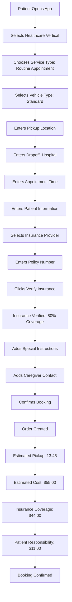

**Journey 2: Driver Completes Healthcare Transport**

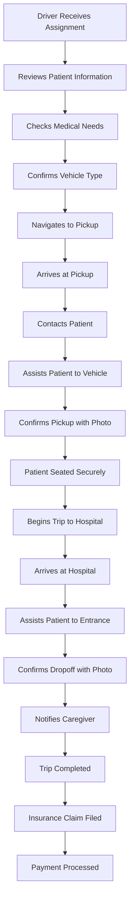

**Journey 3: Recurring Dialysis Transport**

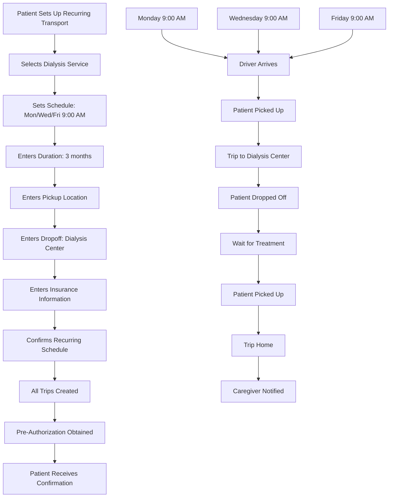

---

## Prototype 4: AI Support Automation

### 4.1 Feature Design

#### 4.1.1 AI Support Capabilities

```yaml
ai_support_capabilities:
  automated_responses:
    common_queries:
      - "Where is my driver?"
      - "How do I cancel my ride?"
      - "I was charged incorrectly"
      - "Driver didn't show up"
      - "I left something in the car"
      - "How do I change my payment method?"
      - "What are your hours?"
      - "How do I contact support?"
      
    handling_percentage: 80
    
  voice_ai:
    capabilities:
      - "Natural language understanding"
      - "Speech recognition"
      - "Text-to-speech"
      - "Multi-language support"
      - "Sentiment analysis"
      
    languages:
      - "English"
      - "Spanish"
      - "French"
      - "German"
      - "Mandarin"
      - "Japanese"
      
  escalation_logic:
    triggers:
      - "Sentiment score < 0.3"
      - "User requests human agent"
      - "Complex issue not in knowledge base"
      - "High-value customer (Platinum tier)"
      - "Safety-related issue"
      - "Fraud report"
      
    routing:
      - "Specialized teams (safety, fraud, billing)"
      - "Priority queue for high-value customers"
      - "Agent availability check"
      - "Estimated wait time provided"
      
  learning:
    feedback_loop:
      - "Rate AI responses"
      - "Track resolution rate"
      - "Identify knowledge gaps"
      - "Continuous model retraining"
      
    improvement_metrics:
      - "First contact resolution"
      - "Customer satisfaction"
      - "Average handle time"
      - "Escalation rate"
```

#### 4.1.2 Database Schema

```sql
-- AI Support Tables
support_conversations (
  id UUID PK,
  user_id UUID,
  channel ENUM,               -- CHAT, VOICE, EMAIL
  status ENUM,                -- OPEN, IN_PROGRESS, RESOLVED, ESCALATED
  ai_handled BOOLEAN DEFAULT true,
  sentiment_score FLOAT,
  priority ENUM,              -- LOW, MEDIUM, HIGH, URGENT
  assigned_agent_id UUID NULL,
  escalation_reason TEXT NULL,
  created_at TIMESTAMP,
  updated_at TIMESTAMP,
  resolved_at TIMESTAMP NULL
);

support_messages (
  id UUID PK,
  conversation_id UUID,
  sender ENUM,                -- USER, AI, AGENT
  message_type ENUM,          -- TEXT, VOICE_TRANSCRIPT, SYSTEM
  content TEXT,
  audio_url TEXT NULL,
  confidence_score FLOAT NULL,
  created_at TIMESTAMP
);

ai_knowledge_base (
  id UUID PK,
  category TEXT,
  question TEXT,
  answer TEXT,
  keywords JSONB,
  usage_count INT DEFAULT 0,
  success_rate FLOAT DEFAULT 0.0,
  last_updated TIMESTAMP,
  created_at TIMESTAMP
);

ai_response_feedback (
  id UUID PK,
  message_id UUID,
  conversation_id UUID,
  user_rating INT,            -- 1-5 stars
  was_helpful BOOLEAN,
  follow_up_required BOOLEAN,
  user_comment TEXT,
  created_at TIMESTAMP
);

support_agents (
  id UUID PK,
  user_id UUID,
  specialization JSONB,       -- SAFETY, FRAUD, BILLING, GENERAL
  language_skills JSONB,
  availability_status ENUM,   -- AVAILABLE, BUSY, OFFLINE
  current_conversation_id UUID NULL,
  created_at TIMESTAMP
);

escalation_rules (
  id UUID PK,
  rule_name TEXT,
  condition JSONB,
  action JSONB,
  priority INT,
  active BOOLEAN DEFAULT true,
  created_at TIMESTAMP
);
```

#### 4.1.3 API Endpoints

```yaml
ai_support_apis:
  POST /api/v1/support/conversation:
    description: "Start or continue support conversation"
    body:
      channel: "CHAT"
      message: "Where is my driver?"
      order_id: "uuid"
    response:
      conversation_id: "uuid"
      ai_response: "Your driver is 2 minutes away..."
      confidence: 0.95
      
  POST /api/v1/support/conversation/{id}/message:
    description: "Send message to conversation"
    body:
      message: "I want to speak to a human"
    response:
      message_id: "uuid"
      response: "I'll connect you with an agent..."
      estimated_wait_time: 5
      
  POST /api/v1/support/conversation/{id}/escalate:
    description: "Escalate to human agent"
    body:
      reason: "Complex issue"
      priority: "HIGH"
    response:
      escalated: true
      agent_assigned: true
      estimated_wait_time: 3
      
  GET /api/v1/support/conversation/{id}:
    description: "Get conversation details"
    response:
      conversation: {...}
      messages: [...]
      status: "IN_PROGRESS"
      
  POST /api/v1/support/conversation/{id}/feedback:
    description: "Provide feedback on AI response"
    body:
      message_id: "uuid"
      rating: 4
      was_helpful: true
      comment: "Good response"
    response:
      feedback_recorded: true
      
  GET /api/v1/support/agents/available:
    description: "Get available support agents"
    parameters:
      - specialization: "SAFETY"
      - language: "English"
    response:
      agents: [...]
      
  POST /api/v1/support/voice/call:
    description: "Initiate voice support call"
    body:
      phone_number: "+1234567890"
      language: "English"
    response:
      call_id: "uuid"
      status: "CONNECTED"
      ai_agent: true
```

### 4.2 Service Boundary Model

```yaml
ai_support_service_boundaries:
  owns:
    - "AI conversation management"
    - "Knowledge base"
    - "Escalation rules"
    - "Agent assignment"
    - "Feedback collection"
    - "Performance metrics"
    
  consumes:
    - "Order Service: For order-related queries"
    - "User Service: For user account queries"
    - "Payment Service: For billing queries"
    - "Trip Service: For trip tracking"
    - "Identity Service: For user authentication"
    
  provides:
    - "Chat support API"
    - "Voice support API"
    - "Email support API"
    - "Agent dashboard API"
    - "Analytics API"
    
  events_published:
    - "SUPPORT_CONVERSATION_CREATED"
    - "SUPPORT_CONVERSATION_ESCALATED"
    - "SUPPORT_CONVERSATION_RESOLVED"
    - "AI_FEEDBACK_RECEIVED"
    
  events_subscribed:
    - "ORDER_CANCELLED"
    - "PAYMENT_FAILED"
    - "FRAUD_FLAGGED"
    - "SOS_TRIGGERED"
```

### 4.3 Pricing Scenario

**Cost Savings Analysis:**

```yaml
ai_support_economics:
  current_state:
    - "Total support tickets: 100,000/month"
    - "Average cost per ticket: $5.00"
    - "Monthly support cost: $500,000"
    - "Annual support cost: $6,000,000"
    
  with_ai_automation:
    automation_rate: 80
    automated_tickets: 80,000/month
    human_handled_tickets: 20,000/month
    
    cost_per_automated_ticket: $0.50
    cost_per_human_ticket: $5.00
    
    monthly_costs:
      - "Automated: $40,000"
      - "Human: $100,000"
      - "Total: $140,000"
      
    annual_costs: $1,680,000
    
  savings:
    monthly: $360,000
    annual: $4,320,000
    savings_percentage: 72%
    
  investment:
    ai_development: $500,000
    knowledge_base_creation: $100,000
    integration: $200,000
    total_investment: $800,000
    
  roi:
    monthly_savings: $360,000
    payback_period: 2.2 months
    annual_roi: 540%
    
  additional_benefits:
    - "24/7 support availability"
    - "Multi-language support"
    - "Consistent quality"
    - "Scalability"
    - "Data collection for insights"
```

### 4.4 User Journey Flow

**Journey 1: User Gets AI Support**

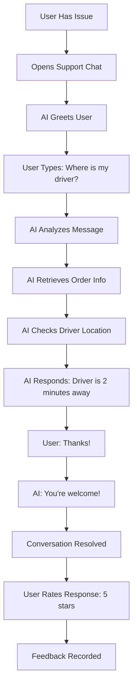

**Journey 2: User Escalates to Human**

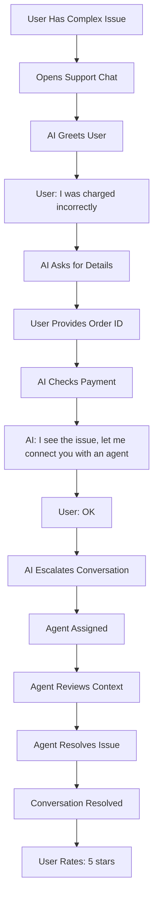

**Journey 3: Voice Support**

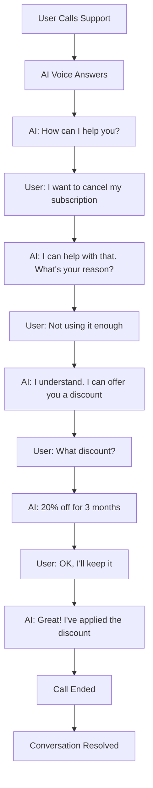

---

## Prototype 5: Premium Driver Matching

### 5.1 Feature Design

#### 5.1.1 Premium Matching Features

```yaml
premium_matching_features:
  driver_quality_criteria:
    rating:
      minimum: 4.8
      weight: 0.35
      
    acceptance_rate:
      minimum: 95%
      weight: 0.25
      
    cancellation_rate:
      maximum: 2%
      weight: 0.15
      
    reliability:
      eta_accuracy: 90%
      on_time_pickup: 95%
      weight: 0.15
      
    experience:
      minimum_rides: 500
      tenure_months: 6
      weight: 0.10
      
  premium_fee:
    base_fee: 2.00
    distance_fee: 0.10 per mile
    time_fee: 0.05 per minute
    maximum_fee: 10.00
    
  satisfaction_guarantee:
    - "Full refund if rating < 4.0"
    - "Free premium matching on next ride"
    - "24-hour claim window"
    
  premium_driver_badges:
    - "Top 10% of drivers"
    - "Verified premium status"
    - "Higher earnings (10% bonus)"
    - "Priority for premium requests"
```

#### 5.1.2 Database Schema

```sql
-- Premium Matching Tables
premium_driver_qualifications (
  id UUID PK,
  driver_id UUID UNIQUE,
  is_premium BOOLEAN DEFAULT false,
  rating_score FLOAT,
  acceptance_rate FLOAT,
  cancellation_rate FLOAT,
  eta_accuracy FLOAT,
  on_time_pickup_rate FLOAT,
  total_rides INT,
  tenure_months INT,
  last_evaluated TIMESTAMP,
  premium_since TIMESTAMP,
  created_at TIMESTAMP
);

premium_orders (
  id UUID PK,
  order_id UUID UNIQUE,
  user_id UUID,
  driver_id UUID,
  premium_fee DECIMAL,
  base_fare DECIMAL,
  total_fare DECIMAL,
  driver_bonus DECIMAL,
  satisfaction_guarantee BOOLEAN DEFAULT true,
  rating INT NULL,
  refund_requested BOOLEAN DEFAULT false,
  refund_processed BOOLEAN DEFAULT false,
  created_at TIMESTAMP
);

premium_refund_requests (
  id UUID PK,
  premium_order_id UUID,
  reason TEXT,
  rating_received INT,
  refund_amount DECIMAL,
  status ENUM,                -- PENDING, APPROVED, REJECTED, PROCESSED
  requested_at TIMESTAMP,
  processed_at TIMESTAMP NULL,
  processed_by UUID NULL
);

premium_driver_stats (
  id UUID PK,
  driver_id UUID,
  date DATE,
  premium_orders_completed INT,
  premium_earnings DECIMAL,
  premium_bonus DECIMAL,
  average_rating FLOAT,
  created_at TIMESTAMP
);
```

#### 5.1.3 API Endpoints

```yaml
premium_matching_apis:
  POST /api/v1/orders/premium:
    description: "Request premium driver matching"
    body:
      pickup_location: {...}
      dropoff_location: {...}
    response:
      order_id: "uuid"
      premium_fee: 5.00
      estimated_fare: 25.00
      total_fare: 30.00
      driver_info: {...}
      satisfaction_guarantee: true
      
  GET /api/v1/premium/drivers/available:
    description: "Get available premium drivers"
    parameters:
      - location: "lat,lng"
      - radius: 5
    response:
      drivers: [...]
      
  POST /api/v1/premium/refund:
    description: "Request refund for unsatisfactory ride"
    body:
      order_id: "uuid"
      reason: "Driver was late"
      rating: 3
    response:
      refund_request_id: "uuid"
      refund_amount: 30.00
      estimated_processing_time: "24 hours"
      
  GET /api/v1/premium/stats:
    description: "Get premium matching statistics"
    response:
      total_premium_orders: 1000
      average_rating: 4.9
      satisfaction_rate: 0.98
      refund_rate: 0.02
```

### 5.2 Service Boundary Model

```yaml
premium_matching_service_boundaries:
  owns:
    - "Premium driver qualification"
    - "Premium order management"
    - "Premium fee calculation"
    - "Satisfaction guarantee"
    - "Refund processing"
    - "Premium driver stats"
    
  consumes:
    - "Order Service: For base order functionality"
    - "Matching Service: For driver assignment"
    - "Driver Service: For driver data"
    - "Payment Service: For refunds"
    - "Rating Service: For ratings"
    
  provides:
    - "Premium matching API"
    - "Premium driver API"
    - "Refund API"
    - "Stats API"
    
  events_published:
    - "PREMIUM_ORDER_CREATED"
    - "PREMIUM_DRIVER_ASSIGNED"
    - "PREMIUM_RIDE_COMPLETED"
    - "PREMIUM_REFUND_REQUESTED"
    - "PREMIUM_REFUND_PROCESSED"
    
  events_subscribed:
    - "ORDER_COMPLETED"
    - "RATING_SUBMITTED"
```

### 5.3 Pricing Scenario

**Revenue Impact Analysis:**

```yaml
premium_matching_economics:
  assumptions:
    - "Premium adoption rate: 10% of rides"
    - "Current monthly rides: 1M"
    - "Premium rides: 100,000/month"
    - "Average premium fee: $5.00"
    
  revenue:
    monthly_premium_fees: $500,000
    annual_premium_fees: $6,000,000
    
  costs:
    driver_bonus:
      - "10% bonus on premium rides"
      - "Average base fare: $25.00"
      - "Bonus per ride: $2.50"
      - "Monthly bonus cost: $250,000"
      
    refunds:
      - "Refund rate: 2%"
      - "Refunded rides: 2,000/month"
      - "Average refund: $30.00"
      - "Monthly refund cost: $60,000"
      
    operational:
      - "Support: 1% of revenue"
      - "Monthly support cost: $5,000"
      
  total_monthly_costs: $315,000
  total_annual_costs: $3,780,000
  
  net_revenue:
    monthly: $185,000
    annual: $2,220,000
    
  roi:
    investment: $200,000
    monthly_net: $185,000
    payback_period: 1.1 months
    annual_roi: 1,010%
    
  additional_benefits:
    - "Higher customer satisfaction"
    - "Increased retention"
    - "Premium brand positioning"
    - "Driver loyalty"
```

### 5.4 User Journey Flow

**Journey 1: User Requests Premium Driver**

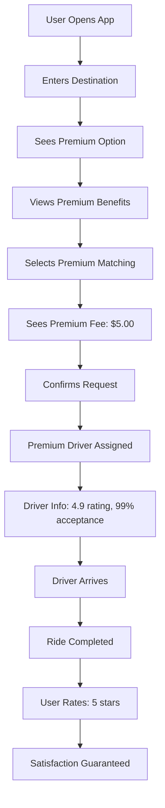

**Journey 2: User Requests Refund**

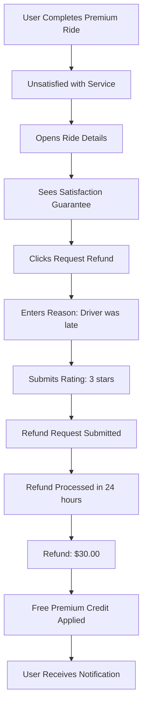

**Journey 3: Driver Earns Premium Bonus**

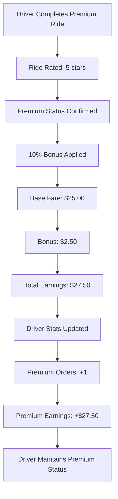

---

## Summary of Prototypes

| Prototype | Key Features | Revenue Impact | Development Effort | Priority |
|-----------|--------------|----------------|-------------------|----------|
| Universal Loyalty Program | Tier system, points, partner integration | $144M/year net | Medium | High |
| Dynamic Subscription Tiers | Monthly/annual plans, benefits | $34M/year net (Year 2) | Medium | High |
| Healthcare Vertical | Specialized transport, insurance integration | $3.2M/year net (Year 2) | High | High |
| AI Support Automation | Chat/voice AI, escalation | $4.3M/year savings | Medium | High |
| Premium Driver Matching | Top drivers, satisfaction guarantee | $2.2M/year net | Low | Medium |

---

**End of Phase 3: Prototype**
