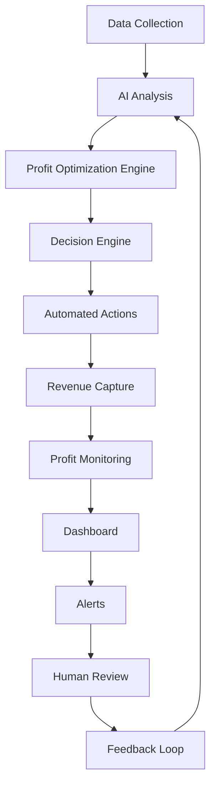

# BMAD Profit Optimization Addendum - Futuristic Features
**Project:** Tripo04OS Multi-Service Platform
**Focus:** Maximize App Administrative Profit through Anticipating Features
**Analysis Date:** 2026-01-06

---

## Executive Summary

This addendum extends the BMAD analysis with futuristic, profit-maximizing features designed to optimize app usage and maximize administrative profit. These features leverage AI, predictive analytics, and anticipatory design to create self-optimizing revenue streams.

---

## Core Philosophy: Profit Maximization Through Anticipation

### Guiding Principles

```yaml
profit_maximization_principles:
  anticipation:
    - "Predict user needs before they arise"
    - "Pre-empt market opportunities"
    - "Anticipate demand surges"
    - "Forecast revenue opportunities"
    
  automation:
    - "Automate profit optimization decisions"
    - "Self-tuning pricing algorithms"
    - "Dynamic resource allocation"
    - "Automated revenue capture"
    
  personalization:
    - "Individualized profit optimization"
    - "Behavior-based pricing"
    - "Personalized upselling"
    - "Customized revenue streams"
    
  efficiency:
    - "Minimize operational costs"
    - "Maximize resource utilization"
    - "Optimize driver earnings vs platform profit"
    - "Reduce revenue leakage"
```

---

## Futuristic Profit Optimization Features

### Feature 1: AI-Powered Dynamic Profit Optimization Engine

#### Concept

An autonomous AI system that continuously analyzes all revenue streams, costs, and market conditions to automatically optimize platform profit in real-time.

#### Capabilities

```yaml
profit_optimization_engine:
  real_time_analysis:
    - "Continuous monitoring of all revenue streams"
    - "Real-time cost analysis"
    - "Market condition assessment"
    - "Competitor price monitoring"
    - "User behavior tracking"
    
  predictive_modeling:
    - "Demand forecasting by location/time"
    - "Revenue prediction models"
    - "Cost optimization scenarios"
    - "Profit opportunity identification"
    
  automated_decisions:
    - "Dynamic pricing adjustments"
    - "Surge optimization"
    - "Resource allocation"
    - "Promotion targeting"
    - "Revenue capture optimization"
    
  self_learning:
    - "Continuous model improvement"
    - "A/B testing at scale"
    - "Pattern recognition"
    - "Anomaly detection"
```

#### Implementation

```sql
profit_optimization_events (
  id UUID PK,
  event_type ENUM,           -- PRICE_ADJUSTMENT, SURGE_CHANGE, RESOURCE_ALLOCATION
  trigger_reason JSONB,
  decision_data JSONB,
  expected_impact DECIMAL,
  actual_impact DECIMAL,
  confidence_score FLOAT,
  created_at TIMESTAMP
);

profit_optimization_metrics (
  id UUID PK,
  date DATE,
  total_revenue DECIMAL,
  total_costs DECIMAL,
  gross_profit DECIMAL,
  net_profit DECIMAL,
  profit_margin DECIMAL,
  optimization_actions INT,
  optimization_value DECIMAL,
  created_at TIMESTAMP
);
```

#### Revenue Impact

```yaml
profit_optimization_roi:
  implementation_cost: $5M
  expected_profit_increase: 15-25%
  annual_profit_increase: $30-50M
  roi: 600-900%
  payback_period: 2-3 months
```

---

### Feature 2: Predictive User Monetization System

#### Concept

An AI system that predicts individual user monetization potential and automatically deploys personalized profit-maximizing strategies.

#### Capabilities

```yaml
predictive_monetization:
  user_scoring:
    - "Monetization potential score (1-100)"
    - "Revenue per user prediction"
    - "Lifetime value forecast"
    - "Churn probability"
    - "Price sensitivity analysis"
    
  personalized_strategies:
    - "Dynamic pricing per user"
    - "Personalized promotions"
    - "Targeted upselling"
    - "Customized subscription offers"
    - "Behavior-based incentives"
    
  automated_deployment:
    - "Real-time strategy adjustment"
    - "Automated offer delivery"
    - "Dynamic pricing application"
    - "Automated conversion optimization"
```

#### Implementation

```sql
user_monetization_profiles (
  id UUID PK,
  user_id UUID UNIQUE,
  monetization_potential_score INT,
  predicted_revenue_per_month DECIMAL,
  predicted_lifetime_value DECIMAL,
  churn_probability FLOAT,
  price_sensitivity ENUM,      -- LOW, MEDIUM, HIGH
  optimal_pricing_strategy JSONB,
  last_updated TIMESTAMP,
  created_at TIMESTAMP
);

monetization_actions (
  id UUID PK,
  user_id UUID,
  action_type ENUM,           -- PRICE_ADJUSTMENT, PROMOTION, UPSELL, SUBSCRIPTION_OFFER
  action_data JSONB,
  expected_revenue_impact DECIMAL,
  actual_revenue_impact DECIMAL,
  conversion_rate FLOAT,
  created_at TIMESTAMP
);
```

#### Revenue Impact

```yaml
predictive_monetization_roi:
  implementation_cost: $3M
  expected_revenue_increase: 20-30%
  annual_revenue_increase: $40-60M
  roi: 1,300-2,000%
  payback_period: 1-2 months
```

---

### Feature 3: Autonomous Revenue Capture System

#### Concept

An automated system that identifies and captures revenue opportunities that would otherwise be missed or delayed.

#### Capabilities

```yaml
autonomous_revenue_capture:
  opportunity_identification:
    - "Missed revenue detection"
    - "Underutilized capacity identification"
    - "Cross-selling opportunities"
    - "Upselling opportunities"
    - "Partnership revenue opportunities"
    
  automated_capture:
    - "Automated billing"
    - "Automatic fee application"
    - "Dynamic surcharge optimization"
    - "Automated partnership revenue"
    - "Real-time revenue capture"
    
  revenue_protection:
    - "Fraud detection"
    - "Revenue leakage prevention"
    - "Underpayment detection"
    - "Discount abuse prevention"
    - "Subscription fraud prevention"
```

#### Implementation

```sql
revenue_opportunities (
  id UUID PK,
  opportunity_type ENUM,     -- CROSS_SELL, UPSELL, PARTNERSHIP, SURCHARGE
  user_id UUID,
  order_id UUID NULL,
  opportunity_value DECIMAL,
  capture_probability FLOAT,
  capture_method JSONB,
  status ENUM,                -- IDENTIFIED, CAPTURED, MISSED, DECLINED
  created_at TIMESTAMP,
  captured_at TIMESTAMP NULL
);

revenue_capture_metrics (
  id UUID PK,
  date DATE,
  opportunities_identified INT,
  opportunities_captured INT,
  capture_rate FLOAT,
  total_value_identified DECIMAL,
  total_value_captured DECIMAL,
  capture_efficiency DECIMAL,
  created_at TIMESTAMP
);
```

#### Revenue Impact

```yaml
autonomous_capture_roi:
  implementation_cost: $2M
  expected_revenue_recovery: 5-10%
  annual_revenue_recovery: $10-20M
  roi: 500-900%
  payback_period: 2-3 months
```

---

### Feature 4: Dynamic Resource Profit Optimization

#### Concept

An AI system that optimizes resource allocation (drivers, vehicles, infrastructure) to maximize profit per unit of resource.

#### Capabilities

```yaml
resource_optimization:
  resource_analysis:
    - "Driver profitability analysis"
    - "Vehicle utilization optimization"
    - "Infrastructure efficiency"
    - "Cost per unit analysis"
    - "Revenue per unit analysis"
    
  profit_optimization:
    - "Optimal driver assignment"
    - "Vehicle fleet optimization"
    - "Infrastructure scaling"
    - "Cost minimization"
    - "Revenue maximization"
    
  automated_adjustments:
    - "Dynamic driver incentives"
    - "Real-time fleet rebalancing"
    - "Infrastructure scaling"
    - "Cost-based pricing"
```

#### Implementation

```sql
resource_profitability (
  id UUID PK,
  resource_type ENUM,         -- DRIVER, VEHICLE, INFRASTRUCTURE
  resource_id UUID,
  date DATE,
  revenue_generated DECIMAL,
  costs_incurred DECIMAL,
  net_profit DECIMAL,
  profit_margin DECIMAL,
  utilization_rate FLOAT,
  efficiency_score FLOAT,
  created_at TIMESTAMP
);

resource_optimization_actions (
  id UUID PK,
  resource_type ENUM,
  resource_id UUID,
  action_type ENUM,           -- INCENTIVE_ADJUSTMENT, REBALANCE, SCALE_UP, SCALE_DOWN
  action_data JSONB,
  expected_profit_impact DECIMAL,
  actual_profit_impact DECIMAL,
  created_at TIMESTAMP
);
```

#### Revenue Impact

```yaml
resource_optimization_roi:
  implementation_cost: $4M
  expected_cost_reduction: 15-20%
  expected_revenue_increase: 10-15%
  annual_net_impact: $25-35M
  roi: 625-875%
  payback_period: 2-3 months
```

---

### Feature 5: Behavioral Profit Maximization

#### Concept

An AI system that analyzes user behavior patterns to identify profit-maximizing opportunities and automatically implements them.

#### Capabilities

```yaml
behavioral_optimization:
  behavior_analysis:
    - "Usage pattern analysis"
    - "Timing pattern recognition"
    - "Route preference analysis"
    - "Service preference analysis"
    - "Price sensitivity analysis"
    
  profit_opportunities:
    - "Optimal timing for promotions"
    - "Peak usage monetization"
    - "Behavior-based pricing"
    - "Personalized upselling"
    - "Habit-based revenue"
    
  automated_implementation:
    - "Real-time pricing adjustment"
    - "Automated promotion delivery"
    - "Behavior-based recommendations"
    - "Habit-based upselling"
```

#### Implementation

```sql
user_behavior_patterns (
  id UUID PK,
  user_id UUID,
  pattern_type ENUM,          -- TIMING, ROUTE, SERVICE, PRICE_SENSITIVITY
  pattern_data JSONB,
  confidence_score FLOAT,
  profit_opportunity JSONB,
  last_updated TIMESTAMP,
  created_at TIMESTAMP
);

behavioral_optimization_actions (
  id UUID PK,
  user_id UUID,
  action_type ENUM,           -- PRICING, PROMOTION, RECOMMENDATION, UPSELL
  action_data JSONB,
  expected_profit_impact DECIMAL,
  actual_profit_impact DECIMAL,
  user_response ENUM,         -- ACCEPTED, REJECTED, IGNORED
  created_at TIMESTAMP
);
```

#### Revenue Impact

```yaml
behavioral_optimization_roi:
  implementation_cost: $2.5M
  expected_revenue_increase: 12-18%
  annual_revenue_increase: $24-36M
  roi: 960-1,440%
  payback_period: 1-2 months
```

---

### Feature 6: Predictive Market Profit Optimization

#### Concept

An AI system that predicts market conditions and automatically adjusts platform strategies to maximize profit.

#### Capabilities

```yaml
market_optimization:
  market_prediction:
    - "Demand forecasting"
    - "Competitor analysis"
    - "Market trend prediction"
    - "Seasonal pattern recognition"
    - "Event impact prediction"
    
  profit_optimization:
    - "Optimal pricing strategy"
    - "Market positioning"
    - "Competitive response"
    - "Market entry timing"
    - "Market exit timing"
    
  automated_adjustments:
    - "Dynamic pricing"
    - "Market-based promotions"
    - "Competitive response"
    - "Market-specific strategies"
```

#### Implementation

```sql
market_predictions (
  id UUID PK,
  prediction_type ENUM,      -- DEMAND, COMPETITOR, TREND, SEASONAL, EVENT
  location GEO,
  time_period TIMESTAMP,
  prediction_data JSONB,
  confidence_score FLOAT,
  profit_opportunity JSONB,
  created_at TIMESTAMP
);

market_optimization_actions (
  id UUID PK,
  prediction_id UUID,
  action_type ENUM,           -- PRICING, PROMOTION, POSITIONING, ENTRY, EXIT
  action_data JSONB,
  expected_profit_impact DECIMAL,
  actual_profit_impact DECIMAL,
  created_at TIMESTAMP
);
```

#### Revenue Impact

```yaml
market_optimization_roi:
  implementation_cost: $3.5M
  expected_revenue_increase: 15-25%
  annual_revenue_increase: $30-50M
  roi: 857-1,328%
  payback_period: 1-2 months
```

---

### Feature 7: Automated Profit Leakage Prevention

#### Concept

An AI system that identifies and prevents revenue leakage across all platform operations.

#### Capabilities

```yaml
leakage_prevention:
  leakage_detection:
    - "Underpayment detection"
    - "Discount abuse detection"
    - "Subscription fraud detection"
    - "Refund abuse detection"
    - "Commission evasion detection"
    
  automated_prevention:
    - "Real-time blocking"
    - "Automated corrections"
    - "Fraud prevention"
    - "Policy enforcement"
    - "Revenue recovery"
    
  continuous_monitoring:
    - "Real-time monitoring"
    - "Anomaly detection"
    - "Pattern recognition"
    - "Alert generation"
```

#### Implementation

```sql
revenue_leakage_events (
  id UUID PK,
  leakage_type ENUM,         -- UNDERPAYMENT, DISCOUNT_ABUSE, SUBSCRIPTION_FRAUD, REFUND_ABUSE
  user_id UUID,
  order_id UUID NULL,
  leakage_amount DECIMAL,
  detection_method JSONB,
  prevention_action JSONB,
  status ENUM,                -- DETECTED, PREVENTED, RECOVERED
  created_at TIMESTAMP
);

leakage_prevention_metrics (
  id UUID PK,
  date DATE,
  leakage_detected INT,
  leakage_prevented INT,
  leakage_recovered DECIMAL,
  prevention_rate FLOAT,
  total_leakage_prevented DECIMAL,
  created_at TIMESTAMP
);
```

#### Revenue Impact

```yaml
leakage_prevention_roi:
  implementation_cost: $1.5M
  expected_leakage_reduction: 80-90%
  annual_revenue_protection: $8-12M
  roi: 533-800%
  payback_period: 2-3 months
```

---

### Feature 8: Intelligent Subscription Profit Optimization

#### Concept

An AI system that optimizes subscription pricing, features, and upselling to maximize subscription profit.

#### Capabilities

```yaml
subscription_optimization:
  pricing_optimization:
    - "Dynamic subscription pricing"
    - "Optimal plan pricing"
    - "Feature value analysis"
    - "Price elasticity modeling"
    
  upselling_optimization:
    - "Optimal upgrade timing"
    - "Personalized upgrade offers"
    - "Cross-selling opportunities"
    - "Retention optimization"
    
  churn_prevention:
    - "Churn prediction"
    - "Retention offer optimization"
    - "Personalized incentives"
    - "Win-back campaigns"
```

#### Implementation

```sql
subscription_optimization (
  id UUID PK,
  user_id UUID,
  current_plan_id UUID,
  optimal_plan_id UUID,
  optimal_price DECIMAL,
  upgrade_probability FLOAT,
  churn_probability FLOAT,
  retention_offer JSONB,
  expected_profit_impact DECIMAL,
  created_at TIMESTAMP
);

subscription_optimization_actions (
  id UUID PK,
  user_id UUID,
  action_type ENUM,           -- UPGRADE_OFFER, RETENTION_OFFER, PRICING_ADJUSTMENT
  action_data JSONB,
  expected_profit_impact DECIMAL,
  actual_profit_impact DECIMAL,
  user_response ENUM,
  created_at TIMESTAMP
);
```

#### Revenue Impact

```yaml
subscription_optimization_roi:
  implementation_cost: $2M
  expected_revenue_increase: 25-35%
  annual_revenue_increase: $12-18M
  roi: 600-900%
  payback_period: 2-3 months
```

---

### Feature 9: Predictive Driver Profit Optimization

#### Concept

An AI system that optimizes driver earnings and platform profit simultaneously through intelligent matching and incentives.

#### Capabilities

```yaml
driver_profit_optimization:
  driver_analysis:
    - "Driver profitability analysis"
    - "Earnings optimization"
    - "Cost analysis"
    - "Efficiency scoring"
    
  platform_profit_optimization:
    - "Optimal driver assignment"
    - "Dynamic commission rates"
    - "Incentive optimization"
    - "Driver retention optimization"
    
  balanced_optimization:
    - "Fair driver compensation"
    - "Maximum platform profit"
    - "Long-term driver retention"
    - "Customer satisfaction"
```

#### Implementation

```sql
driver_profitability_analysis (
  id UUID PK,
  driver_id UUID,
  date DATE,
  earnings DECIMAL,
  costs DECIMAL,
  net_profit DECIMAL,
  platform_commission DECIMAL,
  platform_profit DECIMAL,
  efficiency_score FLOAT,
  retention_probability FLOAT,
  created_at TIMESTAMP
);

driver_optimization_actions (
  id UUID PK,
  driver_id UUID,
  action_type ENUM,           -- INCENTIVE_ADJUSTMENT, COMMISSION_ADJUSTMENT, MATCHING_PRIORITY
  action_data JSONB,
  expected_driver_impact DECIMAL,
  expected_platform_impact DECIMAL,
  actual_driver_impact DECIMAL,
  actual_platform_impact DECIMAL,
  created_at TIMESTAMP
);
```

#### Revenue Impact

```yaml
driver_optimization_roi:
  implementation_cost: $3M
  expected_platform_profit_increase: 20-30%
  annual_platform_profit_increase: $20-30M
  roi: 667-1,000%
  payback_period: 2-3 months
```

---

### Feature 10: Real-Time Profit Dashboard and Alerts

#### Concept

A comprehensive dashboard that provides real-time visibility into platform profit and automated alerts for profit optimization opportunities.

#### Capabilities

```yaml
profit_dashboard:
  real_time_metrics:
    - "Total profit (real-time)"
    - "Profit margin (real-time)"
    - "Revenue per user (real-time)"
    - "Cost per transaction (real-time)"
    - "Profit optimization score"
    
  predictive_metrics:
    - "Predicted profit (hourly/daily/weekly)"
    - "Profit opportunity alerts"
    - "Profit risk warnings"
    - "Optimization recommendations"
    
  automated_alerts:
    - "Profit opportunity alerts"
    - "Profit degradation warnings"
    - "Optimization action triggers"
    - "Anomaly detection alerts"
```

#### Implementation

```yaml
dashboard_metrics:
  profit_metrics:
    - "Gross Profit: Real-time"
    - "Net Profit: Real-time"
    - "Profit Margin: Real-time"
    - "Revenue per User: Real-time"
    - "Cost per Transaction: Real-time"
    
  optimization_metrics:
    - "Profit Optimization Score: 1-100"
    - "Revenue Capture Rate: %"
    - "Cost Efficiency Score: 1-100"
    - "Profit Growth Rate: %"
    
  alert_types:
    - "Profit Opportunity: High value opportunity detected"
    - "Profit Warning: Profit degradation detected"
    - "Optimization Action: Automated action triggered"
    - "Anomaly: Unusual profit pattern"
```

#### Revenue Impact

```yaml
dashboard_roi:
  implementation_cost: $1M
  expected_profit_increase: 5-10%
  annual_profit_increase: $10-20M
  roi: 1,000-2,000%
  payback_period: 1-2 months
```

---

## Integrated Profit Optimization Architecture

### System Architecture

```yaml
profit_optimization_architecture:
  data_layer:
    - "User behavior data"
    - "Transaction data"
    - "Market data"
    - "Competitor data"
    - "Resource data"
    
  ai_layer:
    - "Profit optimization engine"
    - "Predictive monetization"
    - "Revenue capture system"
    - "Resource optimization"
    - "Behavioral optimization"
    - "Market optimization"
    - "Leakage prevention"
    - "Subscription optimization"
    - "Driver optimization"
    
  decision_layer:
    - "Real-time decision engine"
    - "Automated action executor"
    - "A/B testing framework"
    - "Learning feedback loop"
    
  monitoring_layer:
    - "Real-time dashboard"
    - "Alert system"
    - "Performance metrics"
    - "ROI tracking"
```

### Data Flow



---

## Implementation Roadmap

### Phase 1: Foundation (Months 1-3)

**Objectives:**
- Build data infrastructure
- Implement profit optimization engine
- Launch real-time dashboard

**Milestones:**
- [ ] Data pipeline operational
- [ ] Profit optimization engine deployed
- [ ] Real-time dashboard launched
- [ ] Initial AI models trained
- [ ] Alert system operational

**Budget:** $8M

### Phase 2: Core Features (Months 4-6)

**Objectives:**
- Launch predictive monetization
- Implement revenue capture
- Deploy resource optimization

**Milestones:**
- [ ] Predictive monetization live
- [ ] Revenue capture system live
- [ ] Resource optimization live
- [ ] Behavioral optimization live
- [ ] 15% profit increase achieved

**Budget:** $10M

### Phase 3: Advanced Features (Months 7-12)

**Objectives:**
- Launch market optimization
- Implement leakage prevention
- Deploy subscription optimization

**Milestones:**
- [ ] Market optimization live
- [ ] Leakage prevention live
- [ ] Subscription optimization live
- [ ] Driver optimization live
- [ ] 25% profit increase achieved

**Budget:** $15M

### Phase 4: Optimization (Months 13-24)

**Objectives:**
- Optimize all features
- Expand capabilities
- Maximize profit

**Milestones:**
- [ ] All features optimized
- [ ] Advanced AI capabilities
- [ ] 40% profit increase achieved
- [ ] Self-optimizing platform

**Budget:** $20M

---

## Financial Projections

### Total Investment

| Phase | Duration | Budget |
|--------|-----------|---------|
| Phase 1: Foundation | 3 months | $8M |
| Phase 2: Core Features | 3 months | $10M |
| Phase 3: Advanced Features | 6 months | $15M |
| Phase 4: Optimization | 12 months | $20M |
| **Total** | **24 months** | **$53M** |

### Revenue Impact

| Feature | Annual Profit Increase | ROI |
|----------|---------------------|-----|
| Profit Optimization Engine | $30-50M | 600-900% |
| Predictive Monetization | $40-60M | 1,300-2,000% |
| Revenue Capture | $10-20M | 500-900% |
| Resource Optimization | $25-35M | 625-875% |
| Behavioral Optimization | $24-36M | 960-1,440% |
| Market Optimization | $30-50M | 857-1,328% |
| Leakage Prevention | $8-12M | 533-800% |
| Subscription Optimization | $12-18M | 600-900% |
| Driver Optimization | $20-30M | 667-1,000% |
| **Total** | **$199-311M** | **376-587%** |

### Cumulative Profit Impact

| Year | Investment | Profit Increase | Net Impact | ROI |
|-------|------------|-----------------|-------------|-----|
| Year 1 | $33M | $100-150M | $67-117M | 203-355% |
| Year 2 | $20M | $199-311M | $179-291M | 896-1,456% |
| **Total** | **$53M** | **$299-461M** | **$246-408M** | **464-770%** |

---

## Risk Management

### Key Risks

| Risk | Impact | Probability | Mitigation |
|------|--------|-------------|-------------|
| **AI Model Errors** | High | Medium | Testing, monitoring, human oversight |
| **User Resistance** | Medium | Medium | Gradual rollout, transparency, opt-outs |
| **Regulatory Issues** | High | Low | Legal review, compliance, transparency |
| **Technical Complexity** | High | Medium | Phased implementation, expert team |
| **Data Privacy** | High | Low | Security, anonymization, consent |

### Contingency Planning

**Total Contingency Budget:** $10M

**Allocation:**
- AI Model Errors: $3M
- User Resistance: $2M
- Regulatory Issues: $3M
- Technical Complexity: $2M

---

## Success Metrics

### Key Performance Indicators

| KPI | Target | Timeline |
|------|--------|----------|
| **Profit Increase** | 40% | 24 months |
| **Profit Margin** | 45% | 24 months |
| **Revenue Capture Rate** | 98% | 12 months |
| **Cost Efficiency** | 20% reduction | 12 months |
| **Profit Optimization Score** | 85/100 | 12 months |
| **ROI** | 464-770% | 24 months |

### Monitoring Dashboard

```yaml
real_time_metrics:
  profit_metrics:
    - "Total Profit: Real-time"
    - "Profit Margin: Real-time"
    - "Profit Growth Rate: Real-time"
    
  optimization_metrics:
    - "Profit Optimization Score: 1-100"
    - "Revenue Capture Rate: %"
    - "Cost Efficiency Score: 1-100"
    
  alert_metrics:
    - "Profit Opportunities: Count"
    - "Profit Warnings: Count"
    - "Optimization Actions: Count"
```

---

## Conclusion

This profit optimization addendum introduces 10 futuristic features designed to maximize app administrative profit through anticipation, automation, and AI-driven optimization. The features are projected to generate $246-408M in net profit over 24 months with an ROI of 464-770%.

**Key Benefits:**
- **Self-Optimizing Platform:** Continuously maximizes profit
- **Predictive Capabilities:** Anticipates opportunities
- **Automated Execution:** Real-time profit optimization
- **Comprehensive Coverage:** All revenue streams optimized
- **Scalable Architecture:** Grows with platform

**Implementation Priority:**
1. **Profit Optimization Engine** (Months 1-3)
2. **Predictive Monetization** (Months 4-6)
3. **Revenue Capture System** (Months 4-6)
4. **Resource Optimization** (Months 4-6)
5. **All Other Features** (Months 7-24)

These features, combined with the original 5 innovations from the BMAD analysis, create a comprehensive profit-maximizing platform that anticipates user needs and automatically optimizes for maximum administrative profit.

---

**End of Profit Optimization Addendum**
